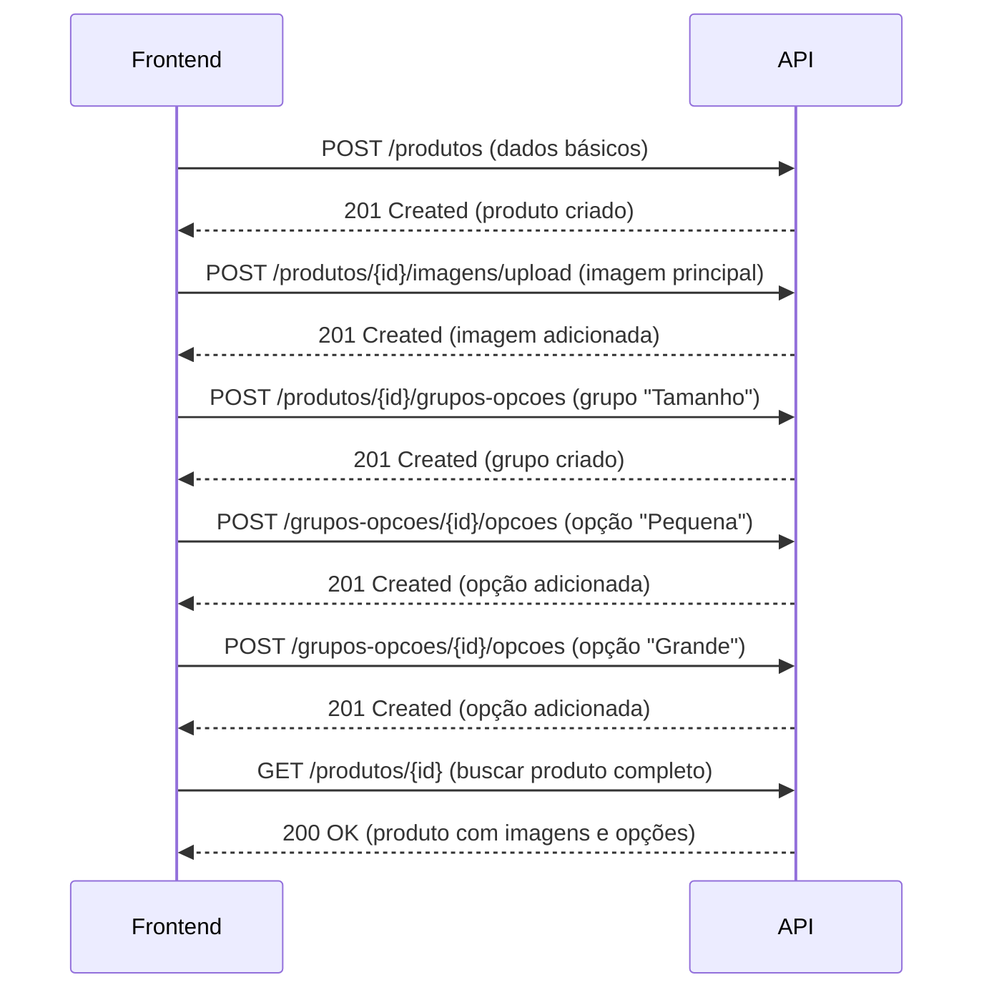
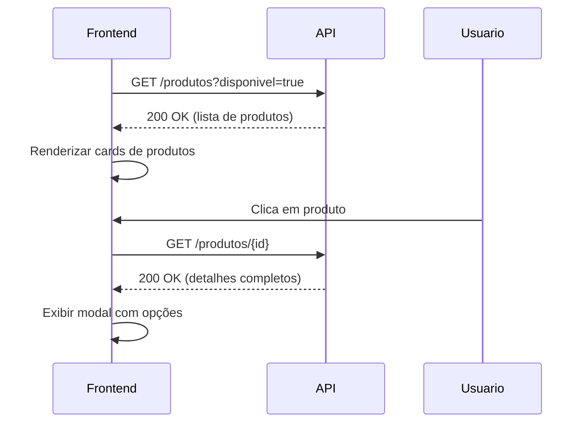
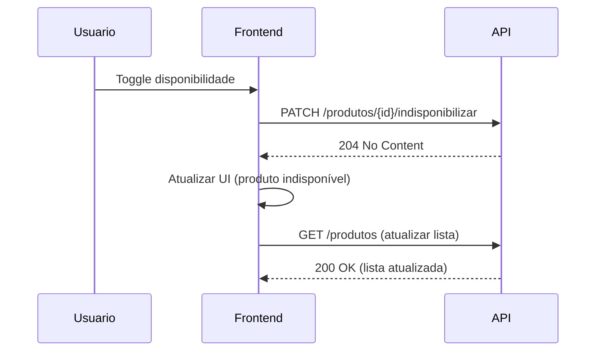

# 📦 API de Produtos - Especificação para Frontend

## 🎯 Visão Geral

API RESTful para gerenciamento completo de produtos, incluindo imagens e opções customizáveis.

**Base URL**: `http://localhost:8081/api/v1/restaurantes/{restauranteId}/produtos`

---

## 📋 Índice

1. [Produtos](#produtos)
2. [Imagens](#imagens)
3. [Grupos de Opções](#grupos-de-opções)
4. [Opções](#opções)
5. [Modelos de Dados](#modelos-de-dados)
6. [Fluxos de Integração](#fluxos-de-integração)

---

## 🍕 Produtos

### 1. Criar Produto

**Endpoint**: `POST /v1/restaurantes/{restauranteId}/produtos`

**Request Body**:
```json
{
  "categoriaId": 1,
  "nome": "Pizza Margherita",
  "descricao": "Molho de tomate, mussarela, manjericão e azeite",
  "preco": 45.90,
  "precoPromocional": 39.90,
  "tempoPreparo": 30,
  "disponivel": true,
  "destaque": true,
  "ordemExibicao": 1
}
```

**Response** (201 Created):
```json
{
  "id": 1,
  "restauranteId": 1,
  "categoriaId": 1,
  "categoriaNome": "Pizzas",
  "nome": "Pizza Margherita",
  "descricao": "Molho de tomate, mussarela, manjericão e azeite",
  "preco": 45.90,
  "precoPromocional": 39.90,
  "precoFinal": 39.90,
  "tempoPreparo": 30,
  "disponivel": true,
  "destaque": true,
  "ordemExibicao": 1,
  "criadoEm": "2025-01-26T10:30:00",
  "atualizadoEm": "2025-01-26T10:30:00",
  "imagens": [],
  "gruposOpcoes": []
}
```

**Validações**:
- `categoriaId`: obrigatório
- `nome`: obrigatório, máximo 255 caracteres
- `descricao`: máximo 2000 caracteres
- `preco`: obrigatório, maior que zero
- `precoPromocional`: opcional, maior que zero
- `tempoPreparo`: opcional, maior ou igual a zero

---

### 2. Buscar Produto por ID

**Endpoint**: `GET /v1/restaurantes/{restauranteId}/produtos/{produtoId}`

**Response** (200 OK):
```json
{
  "id": 1,
  "restauranteId": 1,
  "categoriaId": 1,
  "categoriaNome": "Pizzas",
  "nome": "Pizza Margherita",
  "descricao": "Molho de tomate, mussarela, manjericão e azeite",
  "preco": 45.90,
  "precoPromocional": 39.90,
  "precoFinal": 39.90,
  "tempoPreparo": 30,
  "disponivel": true,
  "destaque": true,
  "ordemExibicao": 1,
  "criadoEm": "2025-01-26T10:30:00",
  "atualizadoEm": "2025-01-26T10:30:00",
  "imagens": [
    {
      "id": 1,
      "url": "https://storage.example.com/pizza-margherita.jpg",
      "principal": true,
      "ordemExibicao": 0
    }
  ],
  "gruposOpcoes": [
    {
      "id": 1,
      "nome": "Tamanho",
      "obrigatorio": true,
      "selecaoMinima": 1,
      "selecaoMaxima": 1,
      "ordemExibicao": 0,
      "opcoes": [
        {
          "id": 1,
          "nome": "Pequena",
          "precoAdicional": 0.00,
          "disponivel": true,
          "ordemExibicao": 0
        },
        {
          "id": 2,
          "nome": "Grande",
          "precoAdicional": 15.00,
          "disponivel": true,
          "ordemExibicao": 1
        }
      ]
    }
  ]
}
```

---

### 3. Listar Produtos

**Endpoint**: `GET /v1/restaurantes/{restauranteId}/produtos`

**Query Parameters**:
- `categoriaId` (opcional): Filtrar por categoria
- `disponivel` (opcional): Filtrar por disponibilidade
- `destaque` (opcional): Filtrar produtos em destaque

**Exemplo**: `GET /v1/restaurantes/1/produtos?categoriaId=1&disponivel=true`

**Response** (200 OK):
```json
[
  {
    "id": 1,
    "nome": "Pizza Margherita",
    "descricao": "Molho de tomate, mussarela, manjericão e azeite",
    "preco": 45.90,
    "precoPromocional": 39.90,
    "precoFinal": 39.90,
    "disponivel": true,
    "destaque": true,
    "imagemPrincipal": "https://storage.example.com/pizza-margherita.jpg"
  },
  {
    "id": 2,
    "nome": "Pizza Calabresa",
    "descricao": "Molho de tomate, mussarela e calabresa",
    "preco": 42.90,
    "precoPromocional": null,
    "precoFinal": 42.90,
    "disponivel": true,
    "destaque": false,
    "imagemPrincipal": "https://storage.example.com/pizza-calabresa.jpg"
  }
]
```

---

### 4. Listar Produtos com Paginação

**Endpoint**: `GET /v1/restaurantes/{restauranteId}/produtos/paginado`

**Query Parameters**:
- `categoriaId` (opcional): Filtrar por categoria
- `page` (opcional, padrão: 0): Número da página
- `size` (opcional, padrão: 20): Tamanho da página
- `sort` (opcional): Campo de ordenação (ex: `nome,asc`)

**Exemplo**: `GET /v1/restaurantes/1/produtos/paginado?page=0&size=10&sort=nome,asc`

**Response** (200 OK):
```json
{
  "content": [
    {
      "id": 1,
      "nome": "Pizza Margherita",
      "descricao": "Molho de tomate, mussarela, manjericão e azeite",
      "preco": 45.90,
      "precoFinal": 39.90,
      "disponivel": true,
      "imagemPrincipal": "https://storage.example.com/pizza-margherita.jpg"
    }
  ],
  "pageable": {
    "pageNumber": 0,
    "pageSize": 10,
    "sort": {
      "sorted": true,
      "unsorted": false,
      "empty": false
    }
  },
  "totalElements": 25,
  "totalPages": 3,
  "last": false,
  "first": true,
  "size": 10,
  "number": 0,
  "numberOfElements": 10,
  "empty": false
}
```

---

### 5. Atualizar Produto

**Endpoint**: `PUT /v1/restaurantes/{restauranteId}/produtos/{produtoId}`

**Request Body**:
```json
{
  "categoriaId": 1,
  "nome": "Pizza Margherita Especial",
  "descricao": "Molho de tomate, mussarela de búfala, manjericão fresco e azeite extravirgem",
  "preco": 52.90,
  "precoPromocional": 45.90,
  "tempoPreparo": 35,
  "disponivel": true,
  "destaque": true,
  "ordemExibicao": 1
}
```

**Response** (200 OK): Mesmo formato do response de criação

---

### 6. Disponibilizar Produto

**Endpoint**: `PATCH /v1/restaurantes/{restauranteId}/produtos/{produtoId}/disponibilizar`

**Response** (204 No Content)

---

### 7. Indisponibilizar Produto

**Endpoint**: `PATCH /v1/restaurantes/{restauranteId}/produtos/{produtoId}/indisponibilizar`

**Response** (204 No Content)

---

### 8. Destacar Produto

**Endpoint**: `PATCH /v1/restaurantes/{restauranteId}/produtos/{produtoId}/destacar`

**Response** (204 No Content)

---

### 9. Remover Destaque

**Endpoint**: `PATCH /v1/restaurantes/{restauranteId}/produtos/{produtoId}/remover-destaque`

**Response** (204 No Content)

---

### 10. Remover Produto

**Endpoint**: `DELETE /v1/restaurantes/{restauranteId}/produtos/{produtoId}`

**Response** (204 No Content)

---

## 🖼️ Imagens

### 1. Adicionar Imagem (JSON)

**Endpoint**: `POST /v1/restaurantes/{restauranteId}/produtos/{produtoId}/imagens`

**Request Body**:
```json
{
  "url": "https://storage.example.com/pizza-margherita-2.jpg",
  "principal": false,
  "ordemExibicao": 1
}
```

**Response** (201 Created):
```json
{
  "id": 2,
  "produtoId": 1,
  "url": "https://storage.example.com/pizza-margherita-2.jpg",
  "principal": false,
  "ordemExibicao": 1,
  "criadoEm": "2025-01-26T11:00:00"
}
```

---

### 2. Upload de Imagem (Multipart)

**Endpoint**: `POST /v1/restaurantes/{restauranteId}/produtos/{produtoId}/imagens/upload`

**Content-Type**: `multipart/form-data`

**Form Data**:
- `arquivo`: (file) Arquivo de imagem
- `principal`: (boolean, opcional, padrão: false)
- `ordemExibicao`: (integer, opcional, padrão: 0)

**Exemplo cURL**:
```bash
curl -X POST \
  http://localhost:8081/api/v1/restaurantes/1/produtos/1/imagens/upload \
  -H "Content-Type: multipart/form-data" \
  -F "arquivo=@pizza.jpg" \
  -F "principal=true" \
  -F "ordemExibicao=0"
```

**Response** (201 Created):
```json
{
  "id": 3,
  "produtoId": 1,
  "url": "https://storage.example.com/uploads/abc123.jpg",
  "principal": true,
  "ordemExibicao": 0,
  "criadoEm": "2025-01-26T11:15:00"
}
```

---

### 3. Listar Imagens

**Endpoint**: `GET /v1/restaurantes/{restauranteId}/produtos/{produtoId}/imagens`

**Response** (200 OK):
```json
[
  {
    "id": 1,
    "produtoId": 1,
    "url": "https://storage.example.com/pizza-margherita.jpg",
    "principal": true,
    "ordemExibicao": 0,
    "criadoEm": "2025-01-26T10:30:00"
  },
  {
    "id": 2,
    "produtoId": 1,
    "url": "https://storage.example.com/pizza-margherita-2.jpg",
    "principal": false,
    "ordemExibicao": 1,
    "criadoEm": "2025-01-26T11:00:00"
  }
]
```

---

### 4. Definir Imagem Principal

**Endpoint**: `PATCH /v1/restaurantes/{restauranteId}/produtos/{produtoId}/imagens/{imagemId}/principal`

**Response** (204 No Content)

---

### 5. Remover Imagem

**Endpoint**: `DELETE /v1/restaurantes/{restauranteId}/produtos/{produtoId}/imagens/{imagemId}`

**Response** (204 No Content)

---

## 🎛️ Grupos de Opções

### 1. Adicionar Grupo de Opções

**Endpoint**: `POST /v1/restaurantes/{restauranteId}/produtos/{produtoId}/grupos-opcoes`

**Request Body**:
```json
{
  "nome": "Tamanho",
  "descricao": "Escolha o tamanho da pizza",
  "minimoSelecoes": 1,
  "maximoSelecoes": 1,
  "obrigatorio": true,
  "ordemExibicao": 0
}
```

**Response** (201 Created):
```json
{
  "id": 1,
  "produtoId": 1,
  "nome": "Tamanho",
  "descricao": "Escolha o tamanho da pizza",
  "minimoSelecoes": 1,
  "maximoSelecoes": 1,
  "obrigatorio": true,
  "ordemExibicao": 0,
  "opcoes": []
}
```

---

### 2. Listar Grupos de Opções

**Endpoint**: `GET /v1/restaurantes/{restauranteId}/produtos/{produtoId}/grupos-opcoes`

**Response** (200 OK):
```json
[
  {
    "id": 1,
    "produtoId": 1,
    "nome": "Tamanho",
    "descricao": "Escolha o tamanho da pizza",
    "minimoSelecoes": 1,
    "maximoSelecoes": 1,
    "obrigatorio": true,
    "ordemExibicao": 0,
    "opcoes": [
      {
        "id": 1,
        "nome": "Pequena",
        "precoAdicional": 0.00,
        "disponivel": true,
        "ordemExibicao": 0
      },
      {
        "id": 2,
        "nome": "Grande",
        "precoAdicional": 15.00,
        "disponivel": true,
        "ordemExibicao": 1
      }
    ]
  },
  {
    "id": 2,
    "produtoId": 1,
    "nome": "Adicionais",
    "descricao": "Personalize sua pizza com ingredientes extras",
    "minimoSelecoes": 0,
    "maximoSelecoes": 5,
    "obrigatorio": false,
    "ordemExibicao": 1,
    "opcoes": [
      {
        "id": 3,
        "nome": "Bacon",
        "precoAdicional": 5.00,
        "disponivel": true,
        "ordemExibicao": 0
      },
      {
        "id": 4,
        "nome": "Catupiry",
        "precoAdicional": 4.00,
        "disponivel": true,
        "ordemExibicao": 1
      }
    ]
  }
]
```

---

### 3. Atualizar Grupo de Opções

**Endpoint**: `PUT /v1/restaurantes/{restauranteId}/produtos/{produtoId}/grupos-opcoes/{grupoId}`

**Request Body**:
```json
{
  "nome": "Tamanho da Pizza",
  "descricao": "Escolha o tamanho ideal para você",
  "minimoSelecoes": 1,
  "maximoSelecoes": 1,
  "obrigatorio": true,
  "ordemExibicao": 0
}
```

**Response** (200 OK): Mesmo formato do response de criação

---

### 4. Remover Grupo de Opções

**Endpoint**: `DELETE /v1/restaurantes/{restauranteId}/produtos/{produtoId}/grupos-opcoes/{grupoId}`

**Response** (204 No Content)

---

## ⚙️ Opções

### 1. Adicionar Opção

**Endpoint**: `POST /v1/restaurantes/{restauranteId}/produtos/{produtoId}/grupos-opcoes/{grupoId}/opcoes`

**Request Body**:
```json
{
  "nome": "Média",
  "precoAdicional": 8.00,
  "disponivel": true,
  "ordemExibicao": 1
}
```

**Response** (201 Created):
```json
{
  "id": 5,
  "grupoOpcaoId": 1,
  "nome": "Média",
  "precoAdicional": 8.00,
  "disponivel": true,
  "ordemExibicao": 1,
  "criadoEm": "2025-01-26T12:00:00"
}
```

---

### 2. Listar Opções

**Endpoint**: `GET /v1/restaurantes/{restauranteId}/produtos/{produtoId}/grupos-opcoes/{grupoId}/opcoes`

**Query Parameters**:
- `disponivel` (opcional): Filtrar por disponibilidade

**Exemplo**: `GET /v1/restaurantes/1/produtos/1/grupos-opcoes/1/opcoes?disponivel=true`

**Response** (200 OK):
```json
[
  {
    "id": 1,
    "grupoOpcaoId": 1,
    "nome": "Pequena",
    "precoAdicional": 0.00,
    "disponivel": true,
    "ordemExibicao": 0,
    "criadoEm": "2025-01-26T10:30:00"
  },
  {
    "id": 5,
    "grupoOpcaoId": 1,
    "nome": "Média",
    "precoAdicional": 8.00,
    "disponivel": true,
    "ordemExibicao": 1,
    "criadoEm": "2025-01-26T12:00:00"
  },
  {
    "id": 2,
    "grupoOpcaoId": 1,
    "nome": "Grande",
    "precoAdicional": 15.00,
    "disponivel": true,
    "ordemExibicao": 2,
    "criadoEm": "2025-01-26T10:30:00"
  }
]
```

---

### 3. Atualizar Opção

**Endpoint**: `PUT /v1/restaurantes/{restauranteId}/produtos/{produtoId}/grupos-opcoes/{grupoId}/opcoes/{opcaoId}`

**Request Body**:
```json
{
  "nome": "Média (8 fatias)",
  "precoAdicional": 10.00,
  "disponivel": true,
  "ordemExibicao": 1
}
```

**Response** (200 OK): Mesmo formato do response de criação

---

### 4. Disponibilizar Opção

**Endpoint**: `PATCH /v1/restaurantes/{restauranteId}/produtos/{produtoId}/grupos-opcoes/{grupoId}/opcoes/{opcaoId}/disponibilizar`

**Response** (204 No Content)

---

### 5. Indisponibilizar Opção

**Endpoint**: `PATCH /v1/restaurantes/{restauranteId}/produtos/{produtoId}/grupos-opcoes/{grupoId}/opcoes/{opcaoId}/indisponibilizar`

**Response** (204 No Content)

---

### 6. Remover Opção

**Endpoint**: `DELETE /v1/restaurantes/{restauranteId}/produtos/{produtoId}/grupos-opcoes/{grupoId}/opcoes/{opcaoId}`

**Response** (204 No Content)

---

## 📊 Modelos de Dados

### ProdutoRequest
```typescript
interface ProdutoRequest {
  categoriaId: number;           // Obrigatório
  nome: string;                  // Obrigatório, max 255 caracteres
  descricao?: string;            // Opcional, max 2000 caracteres
  preco: number;                 // Obrigatório, > 0
  precoPromocional?: number;     // Opcional, > 0
  tempoPreparo?: number;         // Opcional, >= 0 (minutos)
  disponivel?: boolean;          // Opcional, padrão: true
  destaque?: boolean;            // Opcional, padrão: false
  ordemExibicao?: number;        // Opcional, >= 0
}
```

### ProdutoResponse
```typescript
interface ProdutoResponse {
  id: number;
  restauranteId: number;
  categoriaId: number;
  categoriaNome: string;
  nome: string;
  descricao: string | null;
  preco: number;
  precoPromocional: number | null;
  precoFinal: number;            // Preço promocional ou preço normal
  tempoPreparo: number | null;
  disponivel: boolean;
  destaque: boolean;
  ordemExibicao: number;
  criadoEm: string;              // ISO 8601
  atualizadoEm: string;          // ISO 8601
  imagens: ImagemProdutoResponse[];
  gruposOpcoes: GrupoOpcaoResponse[];
}
```

### ProdutoResumoResponse
```typescript
interface ProdutoResumoResponse {
  id: number;
  nome: string;
  descricao: string | null;
  preco: number;
  precoPromocional: number | null;
  precoFinal: number;
  disponivel: boolean;
  destaque: boolean;
  imagemPrincipal: string | null;
}
```

### ImagemProdutoRequest
```typescript
interface ImagemProdutoRequest {
  url: string;                   // Obrigatório
  principal?: boolean;           // Opcional, padrão: false
  ordemExibicao?: number;        // Opcional, >= 0
}
```

### ImagemProdutoResponse
```typescript
interface ImagemProdutoResponse {
  id: number;
  produtoId: number;
  url: string;
  principal: boolean;
  ordemExibicao: number;
  criadoEm: string;              // ISO 8601
}
```

### GrupoOpcaoRequest
```typescript
interface GrupoOpcaoRequest {
  nome: string;                  // Obrigatório, max 100 caracteres
  descricao?: string;            // Opcional, max 2000 caracteres
  minimoSelecoes: number;        // Obrigatório, >= 0
  maximoSelecoes: number;        // Obrigatório, >= 1
  obrigatorio: boolean;          // Obrigatório
  ordemExibicao?: number;        // Opcional, >= 0
}
```

**💡 Nota**: O valor/preço adicional fica nas **Opções**, não no Grupo!

### GrupoOpcaoResponse
```typescript
interface GrupoOpcaoResponse {
  id: number;
  produtoId: number;
  nome: string;
  descricao: string | null;
  minimoSelecoes: number;
  maximoSelecoes: number;
  obrigatorio: boolean;
  ordemExibicao: number;
  opcoes: OpcaoResponse[];       // Cada opção tem seu precoAdicional
}
```

### OpcaoRequest
```typescript
interface OpcaoRequest {
  nome: string;                  // Obrigatório, max 255 caracteres
  precoAdicional: number;        // Obrigatório, >= 0
  disponivel?: boolean;          // Opcional, padrão: true
  ordemExibicao?: number;        // Opcional, >= 0
}
```

### OpcaoResponse
```typescript
interface OpcaoResponse {
  id: number;
  grupoOpcaoId: number;
  nome: string;
  precoAdicional: number;
  disponivel: boolean;
  ordemExibicao: number;
  criadoEm: string;              // ISO 8601
}
```

---

## 🔄 Fluxos de Integração

### Fluxo 1: Cadastro Completo de Produto



**Exemplo de Implementação (JavaScript)**:
```javascript
async function cadastrarProdutoCompleto(restauranteId, dadosProduto) {
  // 1. Criar produto
  const produto = await fetch(`/api/v1/restaurantes/${restauranteId}/produtos`, {
    method: 'POST',
    headers: { 'Content-Type': 'application/json' },
    body: JSON.stringify(dadosProduto)
  }).then(r => r.json());

  // 2. Upload de imagem
  const formData = new FormData();
  formData.append('arquivo', imagemFile);
  formData.append('principal', 'true');
  
  await fetch(`/api/v1/restaurantes/${restauranteId}/produtos/${produto.id}/imagens/upload`, {
    method: 'POST',
    body: formData
  });

  // 3. Criar grupo de opções
  const grupo = await fetch(`/api/v1/restaurantes/${restauranteId}/produtos/${produto.id}/grupos-opcoes`, {
    method: 'POST',
    headers: { 'Content-Type': 'application/json' },
    body: JSON.stringify({
      nome: 'Tamanho',
      descricao: 'Escolha o tamanho',
      minimoSelecoes: 1,
      maximoSelecoes: 1,
      obrigatorio: true,
      ordemExibicao: 0
    })
  }).then(r => r.json());

  // 4. Adicionar opções
  await Promise.all([
    fetch(`/api/v1/restaurantes/${restauranteId}/produtos/${produto.id}/grupos-opcoes/${grupo.id}/opcoes`, {
      method: 'POST',
      headers: { 'Content-Type': 'application/json' },
      body: JSON.stringify({ nome: 'Pequena', precoAdicional: 0, disponivel: true, ordemExibicao: 0 })
    }),
    fetch(`/api/v1/restaurantes/${restauranteId}/produtos/${produto.id}/grupos-opcoes/${grupo.id}/opcoes`, {
      method: 'POST',
      headers: { 'Content-Type': 'application/json' },
      body: JSON.stringify({ nome: 'Grande', precoAdicional: 15, disponivel: true, ordemExibicao: 1 })
    })
  ]);

  // 5. Buscar produto completo
  return await fetch(`/api/v1/restaurantes/${restauranteId}/produtos/${produto.id}`)
    .then(r => r.json());
}
```

---

### Fluxo 2: Listagem de Produtos para Cardápio



**Exemplo de Implementação (React)**:
```javascript
function CardapioProdutos({ restauranteId }) {
  const [produtos, setProdutos] = useState([]);
  const [produtoSelecionado, setProdutoSelecionado] = useState(null);

  useEffect(() => {
    // Carregar produtos disponíveis
    fetch(`/api/v1/restaurantes/${restauranteId}/produtos?disponivel=true`)
      .then(r => r.json())
      .then(setProdutos);
  }, [restauranteId]);

  const abrirDetalhes = async (produtoId) => {
    const detalhes = await fetch(`/api/v1/restaurantes/${restauranteId}/produtos/${produtoId}`)
      .then(r => r.json());
    setProdutoSelecionado(detalhes);
  };

  return (
    <div>
      {produtos.map(produto => (
        <ProdutoCard 
          key={produto.id} 
          produto={produto} 
          onClick={() => abrirDetalhes(produto.id)} 
        />
      ))}
      {produtoSelecionado && (
        <ProdutoModal produto={produtoSelecionado} onClose={() => setProdutoSelecionado(null)} />
      )}
    </div>
  );
}
```

---

### Fluxo 3: Gerenciamento de Disponibilidade



**Exemplo de Implementação (JavaScript)**:
```javascript
async function toggleDisponibilidade(restauranteId, produtoId, disponivel) {
  const endpoint = disponivel ? 'disponibilizar' : 'indisponibilizar';
  
  await fetch(`/api/v1/restaurantes/${restauranteId}/produtos/${produtoId}/${endpoint}`, {
    method: 'PATCH'
  });

  // Atualizar lista de produtos
  const produtosAtualizados = await fetch(`/api/v1/restaurantes/${restauranteId}/produtos`)
    .then(r => r.json());
  
  return produtosAtualizados;
}
```

---

### Fluxo 4: Upload de Múltiplas Imagens

```javascript
async function uploadMultiplasImagens(restauranteId, produtoId, arquivos) {
  const uploads = arquivos.map((arquivo, index) => {
    const formData = new FormData();
    formData.append('arquivo', arquivo);
    formData.append('principal', index === 0 ? 'true' : 'false');
    formData.append('ordemExibicao', index.toString());

    return fetch(`/api/v1/restaurantes/${restauranteId}/produtos/${produtoId}/imagens/upload`, {
      method: 'POST',
      body: formData
    });
  });

  const resultados = await Promise.all(uploads);
  return await Promise.all(resultados.map(r => r.json()));
}
```

---

## 🚨 Tratamento de Erros

### Erros Comuns

**400 Bad Request** - Validação falhou
```json
{
  "timestamp": "2025-01-26T10:30:00",
  "status": 400,
  "error": "Validation Failed",
  "message": "Dados inválidos fornecidos",
  "path": "/api/v1/restaurantes/1/produtos",
  "method": "POST",
  "details": {
    "nome": "Nome é obrigatório",
    "preco": "Preço deve ser maior que zero"
  }
}
```

**404 Not Found** - Recurso não encontrado
```json
{
  "timestamp": "2025-01-26T10:30:00",
  "status": 404,
  "error": "Not Found",
  "message": "Produto não encontrado",
  "path": "/api/v1/restaurantes/1/produtos/999",
  "method": "GET"
}
```

**409 Conflict** - Conflito de dados
```json
{
  "timestamp": "2025-01-26T10:30:00",
  "status": 409,
  "error": "Conflict",
  "message": "Já existe um produto com este nome",
  "path": "/api/v1/restaurantes/1/produtos",
  "method": "POST"
}
```

---

## 💡 Dicas de Implementação

### 1. Cache de Produtos
```javascript
// Implementar cache local para melhorar performance
const produtosCache = new Map();

async function buscarProduto(restauranteId, produtoId) {
  const cacheKey = `${restauranteId}-${produtoId}`;
  
  if (produtosCache.has(cacheKey)) {
    return produtosCache.get(cacheKey);
  }

  const produto = await fetch(`/api/v1/restaurantes/${restauranteId}/produtos/${produtoId}`)
    .then(r => r.json());
  
  produtosCache.set(cacheKey, produto);
  return produto;
}
```

### 2. Debounce para Filtros
```javascript
import { debounce } from 'lodash';

const buscarProdutosFiltrados = debounce(async (restauranteId, filtros) => {
  const params = new URLSearchParams(filtros);
  return await fetch(`/api/v1/restaurantes/${restauranteId}/produtos?${params}`)
    .then(r => r.json());
}, 300);
```

### 3. Validação no Frontend
```javascript
function validarProduto(dados) {
  const erros = {};

  if (!dados.nome || dados.nome.trim() === '') {
    erros.nome = 'Nome é obrigatório';
  }

  if (!dados.preco || dados.preco <= 0) {
    erros.preco = 'Preço deve ser maior que zero';
  }

  if (dados.precoPromocional && dados.precoPromocional >= dados.preco) {
    erros.precoPromocional = 'Preço promocional deve ser menor que o preço normal';
  }

  return Object.keys(erros).length > 0 ? erros : null;
}
```

---

## 📱 Exemplos de UI

### Card de Produto (Lista)
```jsx
function ProdutoCard({ produto, onClick }) {
  return (
    <div className="produto-card" onClick={onClick}>
      
      <h3>{produto.nome}</h3>
      <p>{produto.descricao}</p>
      <div className="preco">
        {produto.precoPromocional ? (
          <>
            <span className="preco-original">R$ {produto.preco.toFixed(2)}</span>
            <span className="preco-promocional">R$ {produto.precoPromocional.toFixed(2)}</span>
          </>
        ) : (
          <span>R$ {produto.preco.toFixed(2)}</span>
        )}
      </div>
      {!produto.disponivel && <span className="badge-indisponivel">Indisponível</span>}
      {produto.destaque && <span className="badge-destaque">⭐ Destaque</span>}
    </div>
  );
}
```

### Modal de Detalhes com Opções
```jsx
function ProdutoModal({ produto, onClose, onAdicionar }) {
  const [opcoesSelecionadas, setOpcoesSelecionadas] = useState({});

  const calcularPrecoTotal = () => {
    let total = produto.precoFinal;
    
    Object.values(opcoesSelecionadas).forEach(opcoes => {
      opcoes.forEach(opcao => {
        total += opcao.precoAdicional;
      });
    });

    return total;
  };

  return (
    <div className="modal">
      <h2>{produto.nome}</h2>
      
      <p>{produto.descricao}</p>

      {produto.gruposOpcoes.map(grupo => (
        <div key={grupo.id} className="grupo-opcoes">
          <h3>
            {grupo.nome}
            {grupo.obrigatorio && <span className="obrigatorio">*</span>}
          </h3>
          {grupo.descricao && <p className="descricao">{grupo.descricao}</p>}
          <p className="info">Selecione de {grupo.minimoSelecoes} a {grupo.maximoSelecoes} opções</p>

          {grupo.opcoes.map(opcao => (
            <label key={opcao.id}>
              <input
                type={grupo.selecaoMaxima === 1 ? 'radio' : 'checkbox'}
                name={`grupo-${grupo.id}`}
                disabled={!opcao.disponivel}
              />
              <span>{opcao.nome}</span>
              {opcao.precoAdicional > 0 && (
                <span>+ R$ {opcao.precoAdicional.toFixed(2)}</span>
              )}
            </label>
          ))}
        </div>
      ))}

      <div className="modal-footer">
        <span className="preco-total">R$ {calcularPrecoTotal().toFixed(2)}</span>
        <button onClick={onAdicionar}>Adicionar ao Carrinho</button>
      </div>
    </div>
  );
}
```

---

## ✅ Checklist de Implementação

### Backend (API)
- [ ] Implementar todos os endpoints da interface ProdutoAPI
- [ ] Configurar validações com Bean Validation
- [ ] Implementar tratamento de exceções
- [ ] Adicionar testes unitários e de integração
- [ ] Configurar CORS para frontend
- [ ] Documentar com Swagger/OpenAPI

### Frontend
- [ ] Criar serviço/API client para produtos
- [ ] Implementar listagem de produtos
- [ ] Implementar detalhes do produto
- [ ] Criar formulário de cadastro/edição
- [ ] Implementar upload de imagens
- [ ] Criar gerenciamento de opções
- [ ] Adicionar filtros e busca
- [ ] Implementar paginação
- [ ] Adicionar loading states
- [ ] Implementar tratamento de erros
- [ ] Adicionar validações no frontend
- [ ] Criar testes E2E

---

**Documentação gerada em**: 26/01/2025  
**Versão da API**: 1.0.0  
**Contato**: DevMaster Team


---

## 💰 Estrutura de Preços - Como Funciona

### Conceito Importante

**Grupo de Opções** = Categoria de escolhas (ex: "Tamanho", "Adicionais", "Borda")
- ❌ **NÃO tem valor/preço**
- ✅ Define regras: obrigatório, mínimo/máximo de seleções

**Opção** = Escolha específica dentro do grupo (ex: "Pequena", "Bacon", "Catupiry")
- ✅ **TEM valor/preço adicional** (`precoAdicional`)
- ✅ Pode ser disponibilizada/indisponibilizada individualmente

### Exemplo Prático: Pizza

```json
{
  "produto": {
    "nome": "Pizza Margherita",
    "preco": 45.90,
    "precoPromocional": 39.90,
    "precoFinal": 39.90,  // ← Preço base do produto
    "gruposOpcoes": [
      {
        "nome": "Tamanho",
        "descricao": "Escolha o tamanho",
        "obrigatorio": true,
        "minimoSelecoes": 1,
        "maximoSelecoes": 1,
        // ❌ Grupo NÃO tem preço
        "opcoes": [
          {
            "nome": "Pequena (4 fatias)",
            "precoAdicional": 0.00  // ✅ Sem custo adicional
          },
          {
            "nome": "Média (6 fatias)",
            "precoAdicional": 8.00  // ✅ +R$ 8,00
          },
          {
            "nome": "Grande (8 fatias)",
            "precoAdicional": 15.00  // ✅ +R$ 15,00
          }
        ]
      },
      {
        "nome": "Adicionais",
        "descricao": "Personalize sua pizza",
        "obrigatorio": false,
        "minimoSelecoes": 0,
        "maximoSelecoes": 5,
        // ❌ Grupo NÃO tem preço
        "opcoes": [
          {
            "nome": "Bacon",
            "precoAdicional": 5.00  // ✅ +R$ 5,00
          },
          {
            "nome": "Catupiry",
            "precoAdicional": 4.00  // ✅ +R$ 4,00
          },
          {
            "nome": "Azeitona",
            "precoAdicional": 2.00  // ✅ +R$ 2,00
          }
        ]
      },
      {
        "nome": "Borda Recheada",
        "descricao": "Deixe sua pizza ainda mais especial",
        "obrigatorio": false,
        "minimoSelecoes": 0,
        "maximoSelecoes": 1,
        // ❌ Grupo NÃO tem preço
        "opcoes": [
          {
            "nome": "Sem borda recheada",
            "precoAdicional": 0.00  // ✅ Sem custo
          },
          {
            "nome": "Borda de Catupiry",
            "precoAdicional": 8.00  // ✅ +R$ 8,00
          },
          {
            "nome": "Borda de Cheddar",
            "precoAdicional": 10.00  // ✅ +R$ 10,00
          }
        ]
      }
    ]
  }
}
```

### Cálculo do Preço Final

**Fórmula**:
```
Preço Total = Preço Base + Soma(precoAdicional das opções selecionadas)
```

**Exemplo de Pedido**:
```javascript
// Cliente escolheu:
// - Tamanho: Grande (+R$ 15,00)
// - Adicionais: Bacon (+R$ 5,00) + Catupiry (+R$ 4,00)
// - Borda: Catupiry (+R$ 8,00)

const precoBase = 39.90;  // precoFinal do produto
const opcoesSelecionadas = [
  { nome: "Grande", precoAdicional: 15.00 },
  { nome: "Bacon", precoAdicional: 5.00 },
  { nome: "Catupiry", precoAdicional: 4.00 },
  { nome: "Borda de Catupiry", precoAdicional: 8.00 }
];

const totalAdicionais = opcoesSelecionadas.reduce(
  (sum, opcao) => sum + opcao.precoAdicional, 
  0
);

const precoTotal = precoBase + totalAdicionais;
// R$ 39,90 + R$ 32,00 = R$ 71,90
```

### Implementação no Frontend

```javascript
function calcularPrecoTotal(produto, opcoesSelecionadas) {
  // Preço base (já considera promoção)
  let total = produto.precoFinal;
  
  // Adiciona o preço de cada opção selecionada
  opcoesSelecionadas.forEach(opcao => {
    total += opcao.precoAdicional;
  });
  
  return total;
}

// Exemplo de uso
const produto = {
  nome: "Pizza Margherita",
  precoFinal: 39.90
};

const selecoes = [
  { id: 2, nome: "Grande", precoAdicional: 15.00 },
  { id: 3, nome: "Bacon", precoAdicional: 5.00 },
  { id: 4, nome: "Catupiry", precoAdicional: 4.00 }
];

const total = calcularPrecoTotal(produto, selecoes);
console.log(`Total: R$ ${total.toFixed(2)}`); // Total: R$ 63,90
```

### Validação de Seleções

```javascript
function validarSelecoes(grupo, opcoesSelecionadas) {
  const qtdSelecionada = opcoesSelecionadas.length;
  
  // Verifica mínimo
  if (qtdSelecionada < grupo.minimoSelecoes) {
    return {
      valido: false,
      mensagem: `Selecione pelo menos ${grupo.minimoSelecoes} opção(ões) em "${grupo.nome}"`
    };
  }
  
  // Verifica máximo
  if (qtdSelecionada > grupo.maximoSelecoes) {
    return {
      valido: false,
      mensagem: `Selecione no máximo ${grupo.maximoSelecoes} opção(ões) em "${grupo.nome}"`
    };
  }
  
  // Verifica obrigatoriedade
  if (grupo.obrigatorio && qtdSelecionada === 0) {
    return {
      valido: false,
      mensagem: `"${grupo.nome}" é obrigatório`
    };
  }
  
  return { valido: true };
}
```

### Componente React Completo

```jsx
function SeletorOpcoes({ grupo, onChange }) {
  const [selecionadas, setSelecionadas] = useState([]);
  const [erro, setErro] = useState(null);

  const handleSelecao = (opcao) => {
    let novaSelecao;

    if (grupo.maximoSelecoes === 1) {
      // Radio button - apenas uma opção
      novaSelecao = [opcao];
    } else {
      // Checkbox - múltiplas opções
      if (selecionadas.find(o => o.id === opcao.id)) {
        novaSelecao = selecionadas.filter(o => o.id !== opcao.id);
      } else {
        if (selecionadas.length >= grupo.maximoSelecoes) {
          setErro(`Máximo de ${grupo.maximoSelecoes} opções`);
          return;
        }
        novaSelecao = [...selecionadas, opcao];
      }
    }

    setSelecionadas(novaSelecao);
    setErro(null);
    
    // Valida e notifica componente pai
    const validacao = validarSelecoes(grupo, novaSelecao);
    onChange(grupo.id, novaSelecao, validacao.valido);
  };

  const calcularAdicional = () => {
    return selecionadas.reduce((sum, o) => sum + o.precoAdicional, 0);
  };

  return (
    <div className="grupo-opcoes">
      <div className="grupo-header">
        <h3>
          {grupo.nome}
          {grupo.obrigatorio && <span className="obrigatorio">*</span>}
        </h3>
        {grupo.descricao && <p className="descricao">{grupo.descricao}</p>}
        <p className="info">
          Selecione {grupo.minimoSelecoes === grupo.maximoSelecoes 
            ? `${grupo.minimoSelecoes}` 
            : `de ${grupo.minimoSelecoes} a ${grupo.maximoSelecoes}`} opção(ões)
        </p>
      </div>

      {erro && <div className="erro">{erro}</div>}

      <div className="opcoes-lista">
        {grupo.opcoes
          .filter(o => o.disponivel)
          .sort((a, b) => a.ordemExibicao - b.ordemExibicao)
          .map(opcao => {
            const selecionada = selecionadas.find(o => o.id === opcao.id);
            
            return (
              <label 
                key={opcao.id} 
                className={`opcao ${selecionada ? 'selecionada' : ''}`}
              >
                <input
                  type={grupo.maximoSelecoes === 1 ? 'radio' : 'checkbox'}
                  name={`grupo-${grupo.id}`}
                  checked={!!selecionada}
                  onChange={() => handleSelecao(opcao)}
                />
                <span className="opcao-nome">{opcao.nome}</span>
                {opcao.precoAdicional > 0 && (
                  <span className="opcao-preco">
                    + R$ {opcao.precoAdicional.toFixed(2)}
                  </span>
                )}
              </label>
            );
          })}
      </div>

      {selecionadas.length > 0 && calcularAdicional() > 0 && (
        <div className="grupo-total">
          Adicional: R$ {calcularAdicional().toFixed(2)}
        </div>
      )}
    </div>
  );
}
```

---

## 🎯 Resumo da Estrutura

| Elemento | Tem Preço? | Responsabilidade |
|----------|------------|------------------|
| **Produto** | ✅ Sim (`preco`, `precoPromocional`, `precoFinal`) | Preço base |
| **Grupo de Opções** | ❌ Não | Define regras de seleção |
| **Opção** | ✅ Sim (`precoAdicional`) | Adiciona custo ao produto |

**Fluxo de Preço**:
```
Produto (R$ 39,90)
  └─ Grupo: Tamanho
      ├─ Opção: Pequena (+ R$ 0,00)
      ├─ Opção: Média (+ R$ 8,00)     ← Cliente escolhe
      └─ Opção: Grande (+ R$ 15,00)
  └─ Grupo: Adicionais
      ├─ Opção: Bacon (+ R$ 5,00)     ← Cliente escolhe
      ├─ Opção: Catupiry (+ R$ 4,00)  ← Cliente escolhe
      └─ Opção: Azeitona (+ R$ 2,00)

Total = R$ 39,90 + R$ 8,00 + R$ 5,00 + R$ 4,00 = R$ 56,90
```

---

**Atualizado em**: 26/01/2025  
**Versão**: 1.1.0


---

## 💵 Cálculo do Valor Total do Pedido

### Estrutura Completa de Preços

O valor total de um pedido é composto por:

```
VALOR TOTAL = SUBTOTAL + TAXA DE ENTREGA - DESCONTO

Onde:
  SUBTOTAL = Soma de todos os itens do pedido
  ITEM = (Preço do Produto + Soma das Opções Selecionadas) × Quantidade
```

### Fórmula Detalhada

```javascript
// 1. Calcular preço de cada item
function calcularPrecoItem(produto, opcoesSelecionadas, quantidade) {
  const precoProduto = produto.precoFinal; // Já considera promoção
  
  const precoOpcoes = opcoesSelecionadas.reduce(
    (sum, opcao) => sum + opcao.precoAdicional,
    0
  );
  
  const precoUnitario = precoProduto + precoOpcoes;
  const precoTotal = precoUnitario * quantidade;
  
  return {
    precoUnitario,
    precoTotal
  };
}

// 2. Calcular subtotal do pedido
function calcularSubtotal(itens) {
  return itens.reduce((sum, item) => sum + item.precoTotal, 0);
}

// 3. Calcular valor total do pedido
function calcularValorTotalPedido(itens, taxaEntrega, desconto = 0) {
  const subtotal = calcularSubtotal(itens);
  const total = subtotal + taxaEntrega - desconto;
  
  return {
    subtotal,
    taxaEntrega,
    desconto,
    total
  };
}
```

### Exemplo Completo de Pedido

```json
{
  "pedido": {
    "numeroPedido": "PED-2025-001234",
    "restaurante": {
      "nome": "Pizzaria Bella",
      "taxaEntrega": 8.00,
      "valorMinimoPedido": 30.00
    },
    "itens": [
      {
        "produto": {
          "nome": "Pizza Margherita",
          "preco": 45.90,
          "precoPromocional": 39.90,
          "precoFinal": 39.90
        },
        "opcoesSelecionadas": [
          {
            "grupo": "Tamanho",
            "opcao": "Grande",
            "precoAdicional": 15.00
          },
          {
            "grupo": "Adicionais",
            "opcao": "Bacon",
            "precoAdicional": 5.00
          },
          {
            "grupo": "Adicionais",
            "opcao": "Catupiry",
            "precoAdicional": 4.00
          },
          {
            "grupo": "Borda",
            "opcao": "Borda de Catupiry",
            "precoAdicional": 8.00
          }
        ],
        "quantidade": 2,
        "precoUnitario": 71.90,
        "precoTotal": 143.80
      },
      {
        "produto": {
          "nome": "Refrigerante 2L",
          "preco": 12.00,
          "precoPromocional": null,
          "precoFinal": 12.00
        },
        "opcoesSelecionadas": [
          {
            "grupo": "Sabor",
            "opcao": "Coca-Cola",
            "precoAdicional": 0.00
          }
        ],
        "quantidade": 1,
        "precoUnitario": 12.00,
        "precoTotal": 12.00
      }
    ],
    "subtotal": 155.80,
    "taxaEntrega": 8.00,
    "desconto": 15.58,
    "valorTotal": 148.22,
    "cupomAplicado": {
      "codigo": "PRIMEIRACOMPRA",
      "desconto": 10,
      "tipoDesconto": "PERCENTUAL"
    }
  }
}
```

### Breakdown do Cálculo

#### Item 1: Pizza Margherita (x2)
```
Produto base:           R$ 39,90
+ Tamanho Grande:       R$ 15,00
+ Bacon:                R$  5,00
+ Catupiry:             R$  4,00
+ Borda de Catupiry:    R$  8,00
─────────────────────────────────
Preço unitário:         R$ 71,90
× Quantidade:                  2
─────────────────────────────────
Subtotal item:          R$ 143,80
```

#### Item 2: Refrigerante 2L (x1)
```
Produto base:           R$ 12,00
+ Sabor Coca-Cola:      R$  0,00
─────────────────────────────────
Preço unitário:         R$ 12,00
× Quantidade:                  1
─────────────────────────────────
Subtotal item:          R$ 12,00
```

#### Total do Pedido
```
Subtotal (itens):       R$ 155,80
+ Taxa de entrega:      R$   8,00
─────────────────────────────────
Total antes desconto:   R$ 163,80
- Desconto (10%):       R$  15,58
─────────────────────────────────
VALOR TOTAL:            R$ 148,22
```

### Implementação Completa

```javascript
class CalculadoraPedido {
  /**
   * Calcula o preço de um item do pedido
   */
  static calcularItem(produto, opcoesSelecionadas, quantidade) {
    // Preço base do produto (já considera promoção)
    const precoProduto = produto.precoFinal;
    
    // Soma das opções selecionadas
    const precoOpcoes = opcoesSelecionadas.reduce(
      (sum, opcao) => sum + opcao.precoAdicional,
      0
    );
    
    // Preço unitário = produto + opções
    const precoUnitario = precoProduto + precoOpcoes;
    
    // Preço total = unitário × quantidade
    const precoTotal = precoUnitario * quantidade;
    
    return {
      precoProduto,
      precoOpcoes,
      precoUnitario,
      quantidade,
      precoTotal
    };
  }

  /**
   * Calcula o subtotal do pedido (soma de todos os itens)
   */
  static calcularSubtotal(itens) {
    return itens.reduce((sum, item) => {
      const { precoTotal } = this.calcularItem(
        item.produto,
        item.opcoesSelecionadas,
        item.quantidade
      );
      return sum + precoTotal;
    }, 0);
  }

  /**
   * Aplica desconto (percentual ou fixo)
   */
  static calcularDesconto(subtotal, cupom) {
    if (!cupom) return 0;

    if (cupom.tipoDesconto === 'PERCENTUAL') {
      return subtotal * (cupom.desconto / 100);
    }
    
    if (cupom.tipoDesconto === 'FIXO') {
      return Math.min(cupom.desconto, subtotal);
    }

    return 0;
  }

  /**
   * Calcula o valor total do pedido
   */
  static calcularPedido(itens, taxaEntrega, cupom = null) {
    const subtotal = this.calcularSubtotal(itens);
    const desconto = this.calcularDesconto(subtotal, cupom);
    const total = subtotal + taxaEntrega - desconto;

    return {
      subtotal: Number(subtotal.toFixed(2)),
      taxaEntrega: Number(taxaEntrega.toFixed(2)),
      desconto: Number(desconto.toFixed(2)),
      total: Number(total.toFixed(2))
    };
  }

  /**
   * Valida valor mínimo do pedido
   */
  static validarValorMinimo(subtotal, valorMinimo) {
    if (subtotal < valorMinimo) {
      return {
        valido: false,
        mensagem: `Valor mínimo do pedido é R$ ${valorMinimo.toFixed(2)}. Faltam R$ ${(valorMinimo - subtotal).toFixed(2)}`
      };
    }
    return { valido: true };
  }
}

// Exemplo de uso
const itens = [
  {
    produto: { nome: "Pizza Margherita", precoFinal: 39.90 },
    opcoesSelecionadas: [
      { nome: "Grande", precoAdicional: 15.00 },
      { nome: "Bacon", precoAdicional: 5.00 },
      { nome: "Catupiry", precoAdicional: 4.00 }
    ],
    quantidade: 2
  },
  {
    produto: { nome: "Refrigerante 2L", precoFinal: 12.00 },
    opcoesSelecionadas: [
      { nome: "Coca-Cola", precoAdicional: 0.00 }
    ],
    quantidade: 1
  }
];

const taxaEntrega = 8.00;
const cupom = { codigo: "PRIMEIRACOMPRA", desconto: 10, tipoDesconto: "PERCENTUAL" };

const resultado = CalculadoraPedido.calcularPedido(itens, taxaEntrega, cupom);

console.log(resultado);
// {
//   subtotal: 155.80,
//   taxaEntrega: 8.00,
//   desconto: 15.58,
//   total: 148.22
// }
```

### Componente React - Resumo do Pedido

```jsx
function ResumoPedido({ itens, taxaEntrega, cupom, valorMinimo }) {
  const calculos = CalculadoraPedido.calcularPedido(itens, taxaEntrega, cupom);
  const validacao = CalculadoraPedido.validarValorMinimo(calculos.subtotal, valorMinimo);

  return (
    <div className="resumo-pedido">
      <h3>Resumo do Pedido</h3>

      {/* Itens */}
      <div className="itens">
        {itens.map((item, index) => {
          const calc = CalculadoraPedido.calcularItem(
            item.produto,
            item.opcoesSelecionadas,
            item.quantidade
          );

          return (
            <div key={index} className="item">
              <div className="item-header">
                <span className="quantidade">{item.quantidade}x</span>
                <span className="nome">{item.produto.nome}</span>
                <span className="preco">R$ {calc.precoTotal.toFixed(2)}</span>
              </div>
              
              {item.opcoesSelecionadas.length > 0 && (
                <div className="opcoes">
                  {item.opcoesSelecionadas.map((opcao, i) => (
                    <div key={i} className="opcao">
                      <span>• {opcao.nome}</span>
                      {opcao.precoAdicional > 0 && (
                        <span>+R$ {opcao.precoAdicional.toFixed(2)}</span>
                      )}
                    </div>
                  ))}
                </div>
              )}
            </div>
          );
        })}
      </div>

      {/* Totais */}
      <div className="totais">
        <div className="linha">
          <span>Subtotal</span>
          <span>R$ {calculos.subtotal.toFixed(2)}</span>
        </div>

        <div className="linha">
          <span>Taxa de entrega</span>
          <span>R$ {calculos.taxaEntrega.toFixed(2)}</span>
        </div>

        {calculos.desconto > 0 && (
          <div className="linha desconto">
            <span>Desconto ({cupom.codigo})</span>
            <span>- R$ {calculos.desconto.toFixed(2)}</span>
          </div>
        )}

        <div className="linha total">
          <span>Total</span>
          <span>R$ {calculos.total.toFixed(2)}</span>
        </div>
      </div>

      {/* Validação */}
      {!validacao.valido && (
        <div className="alerta">
          ⚠️ {validacao.mensagem}
        </div>
      )}

      <button 
        className="btn-finalizar"
        disabled={!validacao.valido}
      >
        Finalizar Pedido
      </button>
    </div>
  );
}
```

### Casos Especiais

#### 1. Frete Grátis
```javascript
const taxaEntrega = pedido.subtotal >= 50.00 ? 0.00 : 8.00;
```

#### 2. Desconto Máximo
```javascript
const descontoMaximo = 20.00;
const desconto = Math.min(
  CalculadoraPedido.calcularDesconto(subtotal, cupom),
  descontoMaximo
);
```

#### 3. Taxa de Serviço (Opcional)
```javascript
const taxaServico = subtotal * 0.10; // 10%
const total = subtotal + taxaEntrega + taxaServico - desconto;
```

### Validações Importantes

```javascript
// 1. Valor mínimo do pedido
if (subtotal < restaurante.valorMinimoPedido) {
  throw new Error(`Valor mínimo: R$ ${restaurante.valorMinimoPedido.toFixed(2)}`);
}

// 2. Produtos disponíveis
itens.forEach(item => {
  if (!item.produto.disponivel) {
    throw new Error(`${item.produto.nome} não está disponível`);
  }
});

// 3. Opções obrigatórias selecionadas
itens.forEach(item => {
  item.produto.gruposOpcoes
    .filter(g => g.obrigatorio)
    .forEach(grupo => {
      const selecionadas = item.opcoesSelecionadas.filter(
        o => o.grupoId === grupo.id
      );
      
      if (selecionadas.length < grupo.minimoSelecoes) {
        throw new Error(`Selecione ${grupo.nome} para ${item.produto.nome}`);
      }
    });
});

// 4. Restaurante aberto
if (!restaurante.aberto) {
  throw new Error('Restaurante fechado no momento');
}

// 5. Cupom válido
if (cupom && !cupom.ativo) {
  throw new Error('Cupom inválido ou expirado');
}
```

---

## 📊 Resumo da Estrutura de Valores

| Componente | Descrição | Exemplo |
|------------|-----------|---------|
| **Preço do Produto** | Valor base (considera promoção) | R$ 39,90 |
| **Preço das Opções** | Soma dos `precoAdicional` | R$ 32,00 |
| **Preço Unitário** | Produto + Opções | R$ 71,90 |
| **Preço do Item** | Unitário × Quantidade | R$ 143,80 |
| **Subtotal** | Soma de todos os itens | R$ 155,80 |
| **Taxa de Entrega** | Frete do restaurante | R$ 8,00 |
| **Desconto** | Cupom aplicado | R$ 15,58 |
| **TOTAL** | Subtotal + Frete - Desconto | **R$ 148,22** |

### Fluxo Visual

```
┌─────────────────────────────────────────┐
│ ITEM 1: Pizza Margherita (x2)           │
├─────────────────────────────────────────┤
│ Produto base:        R$ 39,90           │
│ + Opções:            R$ 32,00           │
│ ─────────────────────────────           │
│ Unitário:            R$ 71,90           │
│ × Quantidade:             2             │
│ ─────────────────────────────           │
│ Total item:          R$ 143,80          │
└─────────────────────────────────────────┘
                  +
┌─────────────────────────────────────────┐
│ ITEM 2: Refrigerante 2L (x1)            │
├─────────────────────────────────────────┤
│ Produto base:        R$ 12,00           │
│ + Opções:            R$  0,00           │
│ ─────────────────────────────           │
│ Total item:          R$ 12,00           │
└─────────────────────────────────────────┘
                  ║
                  ▼
┌─────────────────────────────────────────┐
│ SUBTOTAL:            R$ 155,80          │
│ + Taxa de entrega:   R$   8,00          │
│ - Desconto (10%):    R$  15,58          │
│ ═════════════════════════════           │
│ TOTAL:               R$ 148,22          │
└─────────────────────────────────────────┘
```

---

**Atualizado em**: 26/01/2025  
**Versão**: 1.2.0


---

## 🚚 Taxa de Entrega Customizável

### Como Funciona

A taxa de entrega pode ser informada de duas formas:

1. **Informada no Request** - Usa o valor enviado pelo frontend
2. **Padrão do Restaurante** - Se não informada, usa a taxa cadastrada no restaurante

### Request com Taxa Customizada

```json
{
  "clienteId": 1,
  "restauranteId": 1,
  "enderecoEntregaId": 1,
  "tipoPagamentoId": 1,
  "taxaEntrega": 5.00,
  "observacoes": "Sem cebola",
  "itens": [
    {
      "produtoId": 1,
      "quantidade": 2,
      "observacoes": "Bem passado",
      "opcoes": [1, 2, 3]
    }
  ]
}
```

### Request sem Taxa (Usa a do Restaurante)

```json
{
  "clienteId": 1,
  "restauranteId": 1,
  "enderecoEntregaId": 1,
  "tipoPagamentoId": 1,
  "observacoes": "Sem cebola",
  "itens": [
    {
      "produtoId": 1,
      "quantidade": 2,
      "opcoes": [1, 2, 3]
    }
  ]
}
```

### Casos de Uso

#### 1. Frete Grátis (Promoção)
```javascript
const pedido = {
  ...dadosPedido,
  taxaEntrega: 0.00  // Frete grátis
};
```

#### 2. Taxa Dinâmica por Distância
```javascript
function calcularTaxaPorDistancia(distanciaKm) {
  const taxaBase = 5.00;
  const taxaPorKm = 1.50;
  return taxaBase + (distanciaKm * taxaPorKm);
}

const pedido = {
  ...dadosPedido,
  taxaEntrega: calcularTaxaPorDistancia(3.5)  // R$ 10,25
};
```

#### 3. Frete Grátis Acima de Valor Mínimo
```javascript
function calcularTaxaEntrega(subtotal, taxaPadrao) {
  const valorFreteGratis = 50.00;
  return subtotal >= valorFreteGratis ? 0.00 : taxaPadrao;
}

const taxaEntrega = calcularTaxaEntrega(subtotal, restaurante.taxaEntrega);

const pedido = {
  ...dadosPedido,
  taxaEntrega
};
```

#### 4. Usar Taxa Padrão do Restaurante
```javascript
const pedido = {
  ...dadosPedido,
  // taxaEntrega não informada - usa a do restaurante
};
```

### Lógica no Backend

```java
// Se taxaEntrega vier no request, usa ela
// Senão, usa a taxa padrão do restaurante
BigDecimal taxaEntrega = request.taxaEntrega() != null 
    ? request.taxaEntrega() 
    : restaurante.getTaxaEntrega();
```

### Exemplo Completo no Frontend

```javascript
class GerenciadorPedido {
  static criarPedido(dados, restaurante) {
    const subtotal = this.calcularSubtotal(dados.itens);
    
    // Calcula taxa de entrega
    let taxaEntrega;
    
    if (dados.freteGratis) {
      // Promoção de frete grátis
      taxaEntrega = 0.00;
    } else if (dados.distanciaKm) {
      // Taxa dinâmica por distância
      taxaEntrega = this.calcularTaxaPorDistancia(dados.distanciaKm);
    } else if (subtotal >= restaurante.valorFreteGratis) {
      // Frete grátis acima de valor mínimo
      taxaEntrega = 0.00;
    } else {
      // Usa taxa padrão do restaurante (não envia no request)
      taxaEntrega = null;
    }

    return {
      clienteId: dados.clienteId,
      restauranteId: dados.restauranteId,
      enderecoEntregaId: dados.enderecoEntregaId,
      tipoPagamentoId: dados.tipoPagamentoId,
      taxaEntrega,  // Pode ser null
      observacoes: dados.observacoes,
      codigoCupom: dados.codigoCupom,
      itens: dados.itens
    };
  }

  static calcularTaxaPorDistancia(distanciaKm) {
    const taxaBase = 5.00;
    const taxaPorKm = 1.50;
    const taxaMaxima = 20.00;
    
    const taxa = taxaBase + (distanciaKm * taxaPorKm);
    return Math.min(taxa, taxaMaxima);
  }

  static calcularSubtotal(itens) {
    return itens.reduce((sum, item) => {
      const precoItem = item.produto.precoFinal + 
        item.opcoesSelecionadas.reduce((s, o) => s + o.precoAdicional, 0);
      return sum + (precoItem * item.quantidade);
    }, 0);
  }
}

// Uso
const pedido = GerenciadorPedido.criarPedido({
  clienteId: 1,
  restauranteId: 1,
  enderecoEntregaId: 1,
  tipoPagamentoId: 1,
  distanciaKm: 3.5,  // Taxa dinâmica
  observacoes: "Entregar na portaria",
  itens: [...]
}, restaurante);

// POST /api/v1/pedidos
await fetch('/api/v1/pedidos', {
  method: 'POST',
  headers: { 'Content-Type': 'application/json' },
  body: JSON.stringify(pedido)
});
```

### Componente React - Seletor de Taxa

```jsx
function SeletorTaxaEntrega({ restaurante, subtotal, distanciaKm, onChange }) {
  const [tipoTaxa, setTipoTaxa] = useState('padrao');
  const [taxaCustomizada, setTaxaCustomizada] = useState(null);

  useEffect(() => {
    let taxa;

    switch (tipoTaxa) {
      case 'gratis':
        taxa = 0.00;
        break;
      
      case 'distancia':
        taxa = calcularTaxaPorDistancia(distanciaKm);
        break;
      
      case 'customizada':
        taxa = taxaCustomizada;
        break;
      
      case 'padrao':
      default:
        taxa = null;  // Usa a do restaurante
        break;
    }

    onChange(taxa);
  }, [tipoTaxa, taxaCustomizada, distanciaKm]);

  const calcularTaxaPorDistancia = (km) => {
    return Math.min(5.00 + (km * 1.50), 20.00);
  };

  const taxaFinal = taxaCustomizada ?? restaurante.taxaEntrega;
  const freteGratisDisponivel = subtotal >= restaurante.valorFreteGratis;

  return (
    <div className="seletor-taxa">
      <h4>Taxa de Entrega</h4>

      {freteGratisDisponivel && (
        <div className="alerta-sucesso">
          🎉 Você ganhou frete grátis! Pedido acima de R$ {restaurante.valorFreteGratis.toFixed(2)}
        </div>
      )}

      <div className="opcoes">
        <label>
          <input
            type="radio"
            value="padrao"
            checked={tipoTaxa === 'padrao'}
            onChange={(e) => setTipoTaxa(e.target.value)}
          />
          Taxa Padrão - R$ {restaurante.taxaEntrega.toFixed(2)}
        </label>

        {freteGratisDisponivel && (
          <label>
            <input
              type="radio"
              value="gratis"
              checked={tipoTaxa === 'gratis'}
              onChange={(e) => setTipoTaxa(e.target.value)}
            />
            Frete Grátis - R$ 0,00
          </label>
        )}

        {distanciaKm && (
          <label>
            <input
              type="radio"
              value="distancia"
              checked={tipoTaxa === 'distancia'}
              onChange={(e) => setTipoTaxa(e.target.value)}
            />
            Por Distância ({distanciaKm}km) - R$ {calcularTaxaPorDistancia(distanciaKm).toFixed(2)}
          </label>
        )}

        <label>
          <input
            type="radio"
            value="customizada"
            checked={tipoTaxa === 'customizada'}
            onChange={(e) => setTipoTaxa(e.target.value)}
          />
          Taxa Customizada
        </label>

        {tipoTaxa === 'customizada' && (
          <input
            type="number"
            step="0.01"
            min="0"
            placeholder="Digite o valor"
            value={taxaCustomizada || ''}
            onChange={(e) => setTaxaCustomizada(parseFloat(e.target.value) || 0)}
          />
        )}
      </div>

      <div className="taxa-final">
        Taxa aplicada: <strong>R$ {(taxaFinal || 0).toFixed(2)}</strong>
      </div>
    </div>
  );
}
```

### Validações

```javascript
function validarTaxaEntrega(taxaEntrega) {
  // Taxa não informada é válida (usa a do restaurante)
  if (taxaEntrega === null || taxaEntrega === undefined) {
    return { valido: true };
  }

  // Taxa deve ser >= 0
  if (taxaEntrega < 0) {
    return {
      valido: false,
      mensagem: 'Taxa de entrega não pode ser negativa'
    };
  }

  // Taxa muito alta (suspeita)
  if (taxaEntrega > 100) {
    return {
      valido: false,
      mensagem: 'Taxa de entrega muito alta. Verifique o valor.'
    };
  }

  return { valido: true };
}
```

---

**Atualizado em**: 26/01/2025  
**Versão**: 1.3.0
