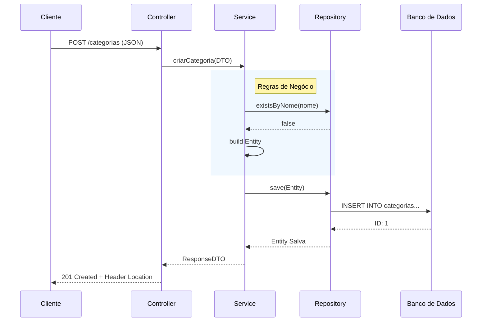

# 🚀 DevMaster - Projeto de Estudos Spring Boot 3 + Java 21

> **Projeto educacional completo** para desenvolvedores que querem **evoluir** suas habilidades ou **retomar** os estudos em Spring Boot com as **tecnologias mais modernas** disponíveis.

## 🎯 Objetivo do Projeto

Este projeto foi criado especificamente para:

- **📚 Estudantes** que querem aprender Spring Boot do zero
- **🔄 Desenvolvedores** que estão retomando os estudos após um tempo
- **⬆️ Profissionais** que querem se atualizar com as versões mais recentes
- **🏗️ Arquitetos** que precisam de uma base sólida para novos projetos

## 🔥 Tecnologias Atuais (2025)

### Core Technologies
- **☕ Java 21 LTS** - Versão LTS estável e moderna
- **🍃 Spring Boot 3.5.9** - Framework mais recente para Java
- **🐘 PostgreSQL 15** - Banco de dados relacional robusto
- **📊 HikariCP** - Pool de conexões de alta performance (integrado)

### Documentation & API
- **📖 SpringDoc OpenAPI 2.7.0** - Documentação OpenAPI nativa
- **🎨 Swagger UI** - Interface visual para testar APIs
- **🔒 Swagger JWT** - Autenticação integrada com cadeado
- **📋 Spring Boot Actuator** - Monitoramento e métricas

### Security
- **🔐 Spring Security 6** - Framework de segurança enterprise
- **🔑 JWT Authentication** - Autenticação stateless com tokens
- **🛡️ Token Validation** - Validação via microserviço externo
- **🚫 CSRF Protection** - Desabilitado para APIs REST (stateless)

### Resilience & Reliability
- **🔧 Resilience4j 2.2.0** - Circuit Breaker, Retry, Timeout
- **🛡️ Fallback Methods** - Respostas alternativas em caso de falha
- **📊 Métricas de Resiliência** - Monitoramento de saúde dos serviços

### Development Tools
- **🔧 Lombok** - Redução de boilerplate code
- **🎯 Spring AOP** - Programação orientada a aspectos
- **📝 Logging Aspect** - Monitoramento automático de performance
- **🧪 Spring Boot Test** - Framework completo de testes
- **🌍 Spring DotEnv** - Suporte nativo para arquivos .env

## 🏗️ Arquitetura do Projeto

### Diagrama de Arquitetura (Mermaid)

```mermaid
graph TD
    Client[Client (Web/Mobile)] -->|HTTP/JSON| API[API REST (Spring Boot)]
    
    subgraph "Application Layer"
        API -->|DTO| Controller[Controller]
        Controller -->|DTO| Service[Service Layer]
    end
    
    subgraph "Domain Layer"
        Service -->|Entity| Domain[Domain Entities]
    end
    
    subgraph "Infrastructure Layer"
        Service -->|Entity| Repository[Repository Interface]
        Repository -->|JPA| Database[(PostgreSQL)]
        Service -->|Client| ExternalAPI[External Services]
    end
```

### Configurações Multi-Ambiente
```
📁 src/main/resources/
├── 🔧 application.yaml              # Configurações gerais
├── 🟢 application-develop.yaml      # Desenvolvimento local
├── 🟡 application-staging.yaml      # Homologação
└── 🔴 application-master.yaml       # Produção
```

### Estrutura de Código Organizada
```
📁 src/main/java/com/devmaster/
├── 📁 application/                  # Camada de aplicação
│   ├── 📁 api/                      # Controllers REST
│   │   ├── 📁 annotation/           # Anotações customizadas
│   │   ├── 📁 request/              # DTOs de requisição
│   │   ├── 📁 response/             # DTOs de resposta
│   │   ├── ProtectedController.java # Endpoints protegidos (JWT)
│   │   └── PublicController.java    # Endpoints públicos
│   ├── 📁 repository/               # Repositórios JPA
│   └── 📁 service/                  # Lógica de negócio
├── 📁 config/                       # Configurações centralizadas
│   ├── LoggingAspect.java           # Logging automático com AOP
│   ├── ResilienceConfig.java        # Circuit Breaker e Resilience4j
│   ├── RestTemplateConfig.java      # Cliente HTTP
│   ├── SecurityConfig.java          # Spring Security + JWT
│   ├── SwaggerConfig.java           # Documentação OpenAPI
│   └── WebConfig.java               # Configurações web
├── 📁 domain/                       # Entidades de domínio
│   └── 📁 enums/                    # Enumerações
├── 📁 handler/                      # Tratamento de exceções
│   ├── 📁 validator/                # Validadores customizados
│   │   ├── TrimString.java          # Anotação para trim
│   │   └── TrimStringValidator.java # Validador de trim
│   ├── APIException.java            # Exceção customizada
│   ├── ErrorApiResponse.java        # Resposta de erro da API
│   ├── ErrorResponse.java           # Resposta de erro genérica
│   └── RestResponseEntityExceptionHandler.java # Handler global
├── 📁 infra/                        # Infraestrutura
├── 📁 security/                     # Segurança e autenticação
│   ├── 📁 exception/                # Exceções de segurança
│   ├── JwtAuthenticationFilter.java # Filtro de autenticação JWT
│   └── JwtTokenValidator.java       # Validador de tokens JWT
├── 📁 util/                         # Utilitários
└── DevmasterApplication.java        # Classe principal
```

## 🚀 Quick Start

### Pré-requisitos
- **Java 21 LTS** instalado
- **Maven 3.9+** para build
- **PostgreSQL 15+** para banco de dados (opcional - pode usar Supabase)
- **IDE** de sua preferência (IntelliJ IDEA, VS Code, Eclipse)

### 1. Clone e Configure
```bash
git clone <repository-url>
cd devmaster
cp .env.example .env
# Edite o arquivo .env com suas configurações
```

> **⚠️ IMPORTANTE**: O arquivo `.env` contém informações sensíveis e está no `.gitignore`. Nunca commite credenciais reais no repositório!

### 2. Inicie o Banco de Dados (Opção Local com Docker)
```bash
# Inicia PostgreSQL + PgAdmin
docker-compose up -d

# Apenas PostgreSQL
docker-compose up -d postgres

# Verificar status
docker-compose ps
```

**Serviços disponíveis:**
- **PostgreSQL**: `localhost:5432`
  - Database: `devmaster_dev`
  - User: `devmaster`
  - Password: `devmaster123`
- **PgAdmin**: `localhost:5050`
  - Email: `admin@devmaster.com`
  - Password: `admin123`

### 3. Execute a Aplicação
```bash
# Desenvolvimento
mvn spring-boot:run

# Ou especifique o ambiente
mvn spring-boot:run -Dspring-boot.run.profiles=develop
```

### 4. Acesse as URLs
- **🏠 Aplicação**: http://localhost:8081/api
- **📖 Swagger UI**: http://localhost:8081/api/swagger
  - **🔒 Clique em "Authorize"** para configurar seu token JWT
  - Insira o token (sem "Bearer") e teste os endpoints protegidos
- **📋 API Docs**: http://localhost:8081/api/api-docs
- **📊 Actuator**: http://localhost:8081/api/actuator
- **🔧 Circuit Breaker Status**: http://localhost:8081/api/resilience/status
- **🧪 Teste de Resiliência**: http://localhost:8081/api/resilience/test/success
- **🛡️ Teste de Exception Handler**: http://localhost:8081/api/demo/exceptions/error-types

## 📚 Conceitos Abordados

### 🔧 Configuração e Setup
- ✅ **Multi-ambiente** com profiles do Spring
- ✅ **Variáveis de ambiente** com suporte nativo .env
- ✅ **Properties externalizadas** para flexibilidade
- ✅ **Docker Compose** para dependências locais (PostgreSQL + PgAdmin)
- ✅ **Circuit Breaker** com Resilience4j para resiliência
- ✅ **Segurança** - Vulnerabilidades corrigidas (CVE-2025-48924)
- ✅ **Spring Security + JWT** - Autenticação com microserviços
- ✅ **Swagger com JWT** - Cadeado de autenticação integrado

### 🗄️ Banco de Dados
- ✅ **Spring Data JPA** configurado (temporariamente desabilitado para testes)
- ✅ **HikariCP** integrado para pool de conexões
- ✅ **Suporte Supabase** para banco cloud
- ✅ **PostgreSQL local** via Docker

### 🌐 APIs REST
- ✅ **Estrutura base** para controllers
- ✅ **Documentação automática** com SpringDoc OpenAPI
- ✅ **Swagger UI** integrado e funcional
- ✅ **Configurações web** otimizadas
- ✅ **Global Exception Handler** - Tratamento centralizado de erros

### 📊 Monitoramento e Logging
- ✅ **Logging estruturado** com Logback
- ✅ **Aspect-Oriented Programming** para cross-cutting concerns
- ✅ **Métricas** com Spring Actuator
- ✅ **Performance monitoring** automático com AOP

#### 🎯 Características do LoggingAspect
- **🎯 Controllers**: Log de entrada e tempo de execução com emojis
- **🔧 Services**: Monitoramento de performance com StopWatch
- **🗄️ Repositories**: Detecção automática de queries lentas (>1s)
- **🚨 Exception Handling**: Log estruturado de erros com stack trace em debug
- **⏱️ Performance Tracking**: Medição precisa com Instant e Duration (Java 21)

### 🧪 Qualidade de Código
- ✅ **Lombok** para código limpo
- ✅ **Padrões de projeto** aplicados
- ✅ **Separação de responsabilidades**
- ✅ **Configuração centralizada**

### 🚀 Funcionalidades Implementadas
- ✅ **Aplicação base** funcional
- ✅ **Swagger UI** acessível em `/api/swagger`

---

## 📚 Guia de Desenvolvimento e Boas Práticas

Este guia serve para orientar o grupo de estudos sobre como manter a qualidade, consistência e arquitetura do projeto.

### 1. Estrutura de Endpoints (Interface First)
Adotamos a abordagem de separar a definição da API (contrato) da implementação.

- **Interface API (`CategoriaAPI.java`)**: Contém as anotações do Swagger (`@Operation`, `@ApiResponse`), mapeamento de rotas (`@RequestMapping`) e validações (`@Valid`).
- **Controller (`CategoriaRestController.java`)**: Implementa a interface e delega a lógica para o Service.

**Benefícios:**
- Código mais limpo no Controller.
- Documentação (Swagger) separada da implementação.
- Facilita a leitura do contrato da API.

### 2. Camada de Serviço e Persistência

#### Services
A camada de serviço contém toda a regra de negócio. Ela não deve conhecer detalhes da camada HTTP (como `ResponseEntity` ou `HttpServletRequest`).

- **Interface Service**: Define os métodos públicos disponíveis.
- **Implementação (ApplicationService)**: Contém a lógica real.
- **@Transactional**: Obrigatório em métodos que alteram o banco de dados. Use `readOnly = true` para métodos de apenas leitura (melhora performance).

#### JPA e Repositories
Boas práticas para acesso a dados com Spring Data JPA:

- **Retorno Optional**: Sempre que buscar um único registro que pode não existir, retorne `Optional<T>`.
- **Derived Queries**: Use nomes de métodos expressivos para gerar queries automaticamente.
- **Paginação**: Sempre suporte `Pageable` em listagens grandes.
- **Projeções**: Se precisar apenas de alguns campos, use Interfaces de Projeção ou DTOs na query para economizar memória.

### 3. Tratamento de Exceções
Nunca utilize `try-catch` nos Controllers ou Services para regras de negócio conhecidas.
- Use `APIException` para lançar erros de negócio.
- O `RestResponseEntityExceptionHandler` captura as exceções e retorna um JSON padronizado.

### 4. Java Records para DTOs
Utilize `record` do Java 21 para classes de Request e Response. São imutáveis, concisos e nativos.

### 5. Lombok
Use Lombok para reduzir código boilerplate, mas com moderação.
- `@RequiredArgsConstructor`: Para injeção de dependência via construtor (obrigatório em Services e Controllers).
- `@Builder`: Para construção de objetos complexos de forma fluente.
- `@Data` ou `@Getter/@Setter`: Em entidades JPA (cuidado: evite `@Data` em entidades com relacionamentos lazy devido ao `toString` e `hashCode`).

### 6. Arquitetura Limpa e Organização
Seguimos uma arquitetura em camadas bem definidas:

1.  **API (Controller)**: Recebe HTTP, valida DTOs, chama Service, retorna `ResponseEntity`.
    *   *Não deve ter regra de negócio.*
2.  **Service**: Contém toda a regra de negócio, validações lógicas, chamadas a repositórios.
    *   *Não deve saber sobre HTTP (não retorna ResponseEntity).*
3.  **Repository**: Interface com o banco de dados (Spring Data JPA).
4.  **Domain**: Entidades persistentes.

### 7. Princípios SOLID Aplicados

- **S (Single Responsibility)**: Controller cuida de HTTP, Service cuida de Negócio.
- **O (Open/Closed)**: Use Interfaces para permitir novas implementações sem alterar código existente.
- **L (Liskov Substitution)**: As implementações devem respeitar o contrato das interfaces.
- **I (Interface Segregation)**: Interfaces de API específicas para cada domínio (ex: `CategoriaAPI`, `ProdutoAPI`).
- **D (Dependency Inversion)**: Injeção de dependência via construtor (`@RequiredArgsConstructor`) em vez de `@Autowired`.

### 8. Design Patterns Utilizados

Padrões de projeto aplicados no DevMaster para resolver problemas comuns de forma elegante.

#### 🏗️ Builder Pattern
Utilizado para construir objetos complexos (Entidades e DTOs) de forma fluente.
- **Onde usamos**: Anotação `@Builder` do Lombok em todas as entidades e alguns DTOs.
- **✅ Quando usar**: Quando o objeto tem muitos atributos ou construtores complexos.
- **❌ Quando NÃO usar**: Em objetos simples com 1 ou 2 atributos (use construtor simples ou `record`).

#### 💉 Dependency Injection (Inversion of Control)
O core do Spring Framework. Invertemos o controle da criação de objetos.
- **Onde usamos**: `@RequiredArgsConstructor` em Controllers e Services.
- **✅ Quando usar**: Sempre que uma classe precisar de outra para funcionar.
- **❌ Quando NÃO usar**: Para objetos de valor (Value Objects), DTOs ou Entidades (esses devem ser criados manualmente ou via Builder).

#### 🛡️ Singleton Pattern
Padrão padrão do Spring para Beans. Existe apenas uma instância de cada Service/Controller/Repository.
- **Onde usamos**: Todos os componentes anotados com `@Service`, `@RestController`, `@Repository`.
- **✅ Quando usar**: Para componentes stateless (sem estado interno que muda por requisição).
- **❌ Quando NÃO usar**: Se a classe precisa guardar estado específico de um usuário/requisição (use `@RequestScope` ou passe o estado como parâmetro).

#### 🗃️ Repository Pattern
Abstração da camada de acesso a dados.
- **Onde usamos**: Interfaces que estendem `JpaRepository`.
- **✅ Quando usar**: Sempre que precisar acessar o banco de dados.
- **❌ Quando NÃO usar**: Para lógicas complexas de negócio que não envolvem persistência direta (use Services).

#### 🎭 Strategy Pattern (Exemplo Futuro)
Permite definir uma família de algoritmos e torná-los intercambiáveis.
- **Exemplo de uso**: Cálculo de Frete (Moto, Carro, Drone) ou Processamento de Pagamento (PIX, Crédito, Boleto).
- **✅ Quando usar**: Quando você tem vários "jeitos" de fazer a mesma coisa e quer escolher em tempo de execução.
- **❌ Quando NÃO usar**: Se existe apenas uma única lógica e nunca vai mudar.

#### 🔌 Adapter Pattern
Permite que interfaces incompatíveis trabalhem juntas.
- **Exemplo**: O Spring Data JPA age como um Adapter sobre o JDBC/Hibernate.
- **✅ Quando usar**: Para integrar bibliotecas externas ou sistemas legados.

### 9. Exemplo de Fluxo Completo (Sequence Diagram)



#### Exemplo de Código

**1. API Interface (Contrato)**
`src/main/java/com/devmaster/application/api/CategoriaAPI.java`

```java
@Tag(name = "Categorias")
@RequestMapping({"/v1/restaurantes/{restauranteId}/categorias", "/v2/restaurantes/{restauranteId}/categorias"})
public interface CategoriaAPI {
    @PostMapping
    @Operation(summary = "Criar nova categoria")
    ResponseEntity<CategoriaResponse> criarCategoria(
        @PathVariable Long restauranteId,
        @Valid @RequestBody CategoriaRequest request
    );
}
```

**2. Controller (Camada HTTP)**
`src/main/java/com/devmaster/application/api/CategoriaRestController.java`

```java
@RestController
@RequiredArgsConstructor
public class CategoriaRestController implements CategoriaAPI {

    private final CategoriaService categoriaService;

    @Override
    public ResponseEntity<CategoriaResponse> criarCategoria(Long restauranteId, CategoriaRequest request) {
        UUID usuarioId = SecurityUtils.getUsuarioLogadoId(); 
        CategoriaResponse response = categoriaService.criarCategoria(usuarioId, restauranteId, request);
        
        URI location = ServletUriComponentsBuilder.fromCurrentRequest()
                .path("/{id}")
                .buildAndExpand(response.id())
                .toUri();
        
        return ResponseEntity.created(location).body(response);
    }
}
```

**3. Service Implementation (Regra de Negócio)**
`src/main/java/com/devmaster/application/service/impl/CategoriaApplicationService.java`

```java
@Service
@RequiredArgsConstructor
public class CategoriaApplicationService implements CategoriaService {

    private final CategoriaRepository categoriaRepository;

    @Override
    @Transactional
    public CategoriaResponse criarCategoria(UUID usuarioId, Long restauranteId, CategoriaRequest request) {
        if (categoriaRepository.existsByRestauranteIdAndNome(restauranteId, request.nome())) {
            throw APIException.build(HttpStatus.CONFLICT, "Categoria já existe");
        }

        Categoria categoria = Categoria.builder()
            .nome(request.nome())
            .ativo(true)
            .build();

        categoria = categoriaRepository.save(categoria);
        return CategoriaResponse.from(categoria);
    }
}
```
